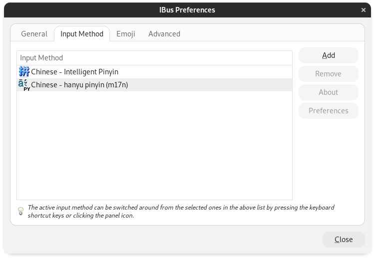

Quick steps to setting up Mandarin Pinyin-based character input on Linux. Steps verified on a fresh install of Debian 11.

Open a new Terminal window. Ensure that the ibus-libpinyin IME is installed:

```bash
apt update
apt install ibus-libpinyin
ibus restart
```

You will likely need root privileges to run the above. Make sure you are signed in as an administrator or using `sudo`. After the above steps, sign back out so that you are the local, non-root user again.

Now run `ibus-setup`. Start the daemon if a window comes up asking you to do so. Navigate to Input Method -> Add and add "Chinese - Intelligent Pinyin". After adding, close the window.

Open the Settings application in GNOME. Go to "Region & Language," then add "Chinese (Intelligent Pinyin)" to the set of Input Sources.

At this point, you should be able to being typing Chinese characters using Pinyin. To switch input methods quickly, use the default keyboard shortcut `<Super>+Space`.

If you think the character choice selection font is too small, like I did, take a look at [this post](https://askubuntu.com/a/1312125) and install the mentioned extension for the font size change to take effect once you configure it in the iBus settings.

If you need to input Pinyin as-is, you should install the m17n IME:

```bash
apt install ibus-m17n
ibus-restart
```

Then follow the same setup steps as for the Intelligent Pinyin input, except this time with the "hanyu pinyin" input:

